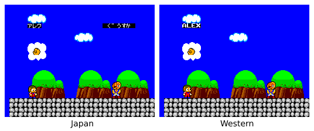
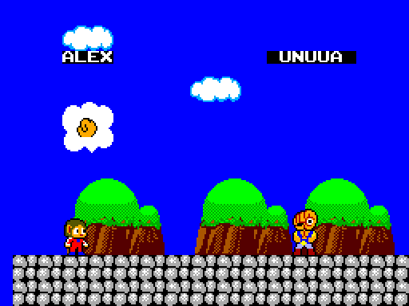

# Trivia

## Opponent names
In the japanese version the opponent name is shown above it. But the it was
removed in the western release:

What is interesting though is that the names are still on the ROM, despite not
being used anymore, and they differ from the JP release:
- Janken: Aniout
- Gooseka: Unuua
- Chokkinna: Louina
- Parplin: Annunin

We can patch the western version adding back the instructions to draw the
opponent name, and this is the result:  
  
*To do: Add screenshots of the remaining opponents.*

Compile the game with the `SHOW_OPPONENT_NAME` definition to enable the opponent names.

## Other trivia
- Level 7 actually has a number seven on it.
- Alex become invincible as soon as the Magic Capsule B is equiped, there is no
need to activate it.
